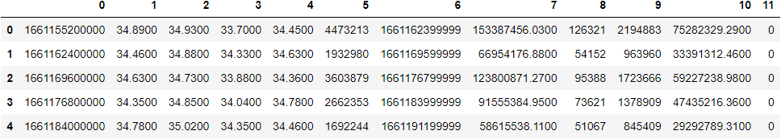

## crypto-challenge

### Purpose
For GS, derive correlations between crypto assets (intra-exchange), on a rolling 30 day window basis.
* Exchange: Binance
* Asset type: USDS-M, Perpetual. (USD margined perpetual instruments)
* Assets: BTCUSDT, ETHUDST, XRPUSDT, ADAUSDT, SOLUSDT
* Demonstrate, process, raw data, results and code utilised.

### Results
Correlations of Binance USDS-M Perps (30d rolling):

")

Example of raw data, upon conversion to Pandas DF (1st 5 rows):

### Process
1) Investigate Binance FAPI docs
2) Query API with customised query_url
    a) contractType = 'PERPETUAL'
    b) interval = '2h'  
    c) limit = 361 (2hr intervals, market open 24/7, 12 intervals p/d x 30 days)
    d) continuousKlines
3) Convert raw json to Pandas DF
4) Convert dates (int64) to datetime64
5) Merge each df (1 per asset) on Open_time
6) Calc pct change p/2hr interval, p/asset
7) Perform linear regression: derive correlations b/w all assets. Refer "Results"
8) Assets pairs: refer above "Results"

### Code
Refer: (https://github.com/chiron-chiron/crypto-challenge/blob/main/correlations.ipynb)